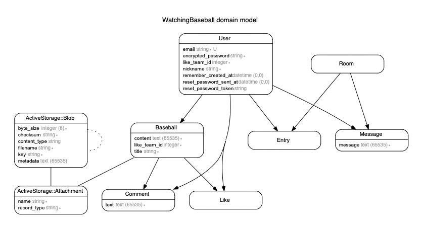

# アプリ名
watching-baseball

# アプリURL
http://54.248.188.240/

# 概要
野球観戦に一緒に行ってくれる人を募集することができます。

# デプロイ先
AWS

# 制作背景
野球観戦をしたいけど、1人で観戦するのはつまらないと思うので、
好きなチームが一緒の人を募集することで仲間を見つけることができます。
普通のSNSでは様々な投稿が行われているので中々一緒に観戦してくれる人を
探すのは難しいですが、このアプリなら野球観戦したい人が投稿するので、
仲間が見つけやすいです。

# 開発環境
Ruby,Rubyonrails,javascript,mysql

# DEMO

# 工夫したポイント
非同期機能を実装してみたかったので、コメント・いいねボタン
に非同期を使用しました。

# テーブル設計

## user テーブル

| Column       | Type    | Option      |
| ------------ | ------- | ----------- |
| nickname     | string  | null: false |
| email        | string  | null: false |
| password     | string  | null: false |
| like_team_id | integer | null: false |

### Association

- has_many :baseballs
- has_many :comments
- has_many :messages
- has_many :entries
- has_many :likes

## baseball テーブル

| Column       | Type       | Option                         |
| ------------ | ---------- | ------------------------------ |
| title        | string     | null: false                    |
| content      | text       | null: false                    |
| like_team_id | integer    | null: false                    |
| user         | references | null: false, foreign_key: true |

### Association

- belongs_to :user
- has_many :comments
- has_many :likes

## comment テーブル

| Column   | Type       | Option                         |
| -------- | ---------- | ------------------------------ |
| text     | text       | null: false                    |
| user     | references | null: false, foreign_key: true |
| baseball | references | null: false, foreign_key: true |

### Association

- belongs_to :user
- belongs_to :baseball

## room テーブル

| Column | Type | option |
| ------ | ---- | ------ |

### Association

- has_many :messages
- has_many :entryies

## entry テーブル

| Column | Type       | Option                         |
| ------ | ---------- | ------------------------------ |
| user   | references | null: false, foreign_key: true |
| room   | references | null: false, foreign_key: true |

### Association

- belongs_to :user
- belongs_to :room

## message テーブル

| Column  | Type       | Option                         |
| ------- | ---------- | ------------------------------ |
| message | text       | null: false                    |
| user    | references | null: false, foreign_key: true |
| room    | references | null: false, foreign_key: true |

### Association

- belongs_to :user
- belongs_to :room

## like テーブル

| Column   | Type       | Option                         |
| -------- | ---------- | ------------------------------ |
| user     | references | null: false, foreign_key: true |
| baseball | references | null: false, foreign_key: true |

### Association

- belongs_to :user
- belongs_to :baseball

